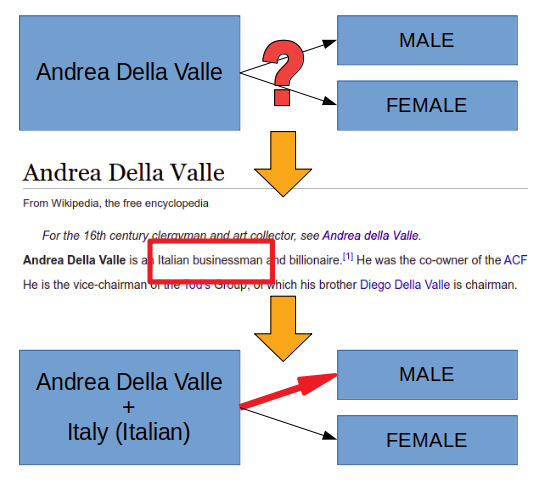
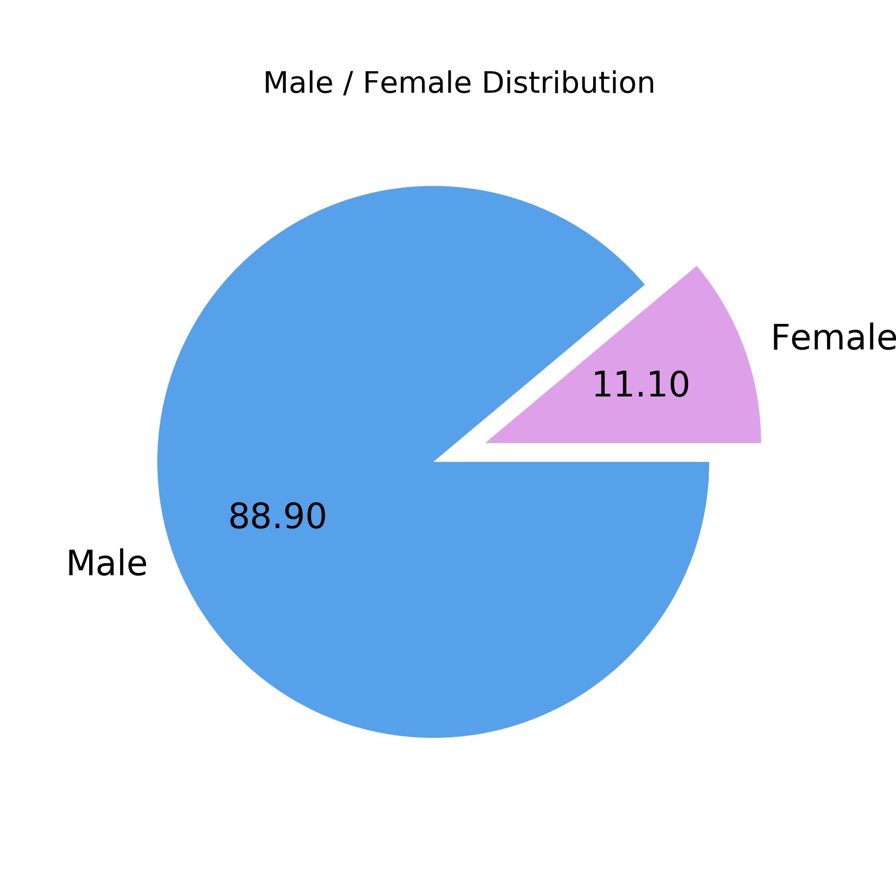
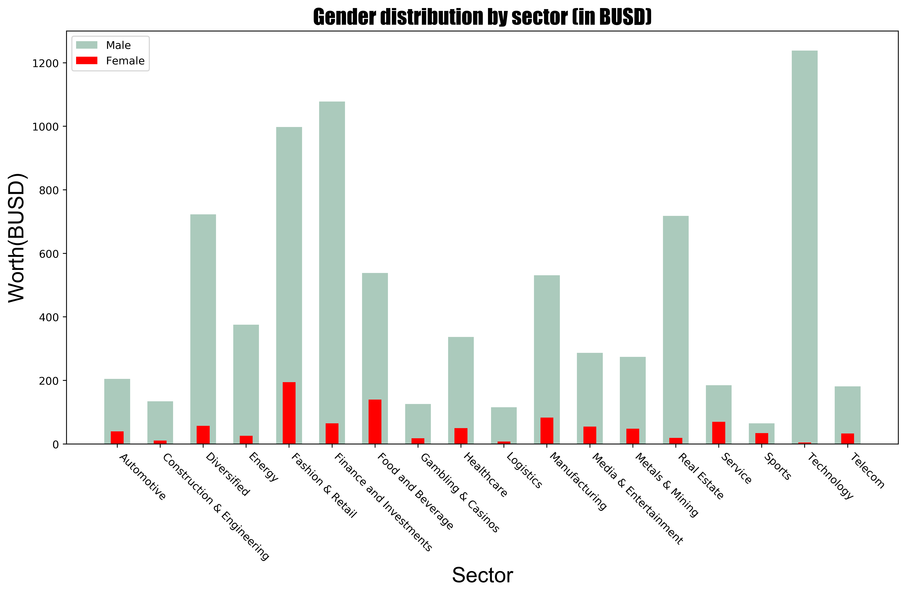

# IronHack Data Analytics Bootcamp Module 1 Project

  

### :boom: Core technical concepts and inspiration
This was the first project of the Ironhack Data Analytics Bootcamp. The main goal was to gather meaningful insights from a data set about the wealthiest men and women on earth. All steps taken to access and enhance the data as well as the main python modules used to perform such actions are described as follows:

- Access the database (sqlalchemy and SQL queries)

- Data manipulation and cleaning (Pandas, Requests, BeautifulSoup)

- Reporting (Matplotlib, Email)

### :computer: Process description
What this analysis attempts to confirm is whether there is a relevant difference between men and women. The main hurdle I encountered while performing the analysis was that both, nationality and gender column, had a significant amount of null and empty fields.
This was worked out by accessing a free API which returned a gender (Male or Female) by providing a name. This method gave good results, however, it was improved by providing a nationality alongside the name. Nationality, citizenship or birthplace was retrieved parsing each millionaire's wikipedia page.

The clearest example where knowing the nationality would be useful is with the name "Andrea", being a female name in Spain but commonly used by men in Italy.

  

### :bar_chart: Results
The analysis confirms what was previously thought, men outnumber women in all analyzed sectors. However, the distribution doesn't follow the same pattern in both genders. As can be seen in the bar chart, technology, finance and fashion will be the sectors where men's wealth is mostly allocated while fashion, food and manufacturing where you could find the bulk of women's wealth.

  

  

